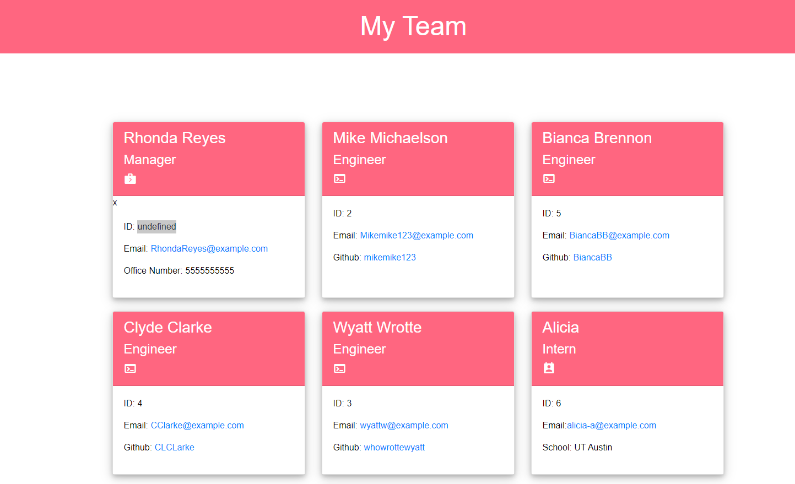
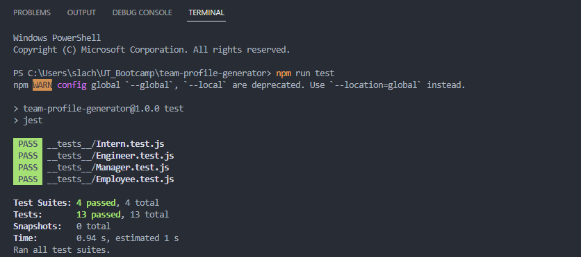
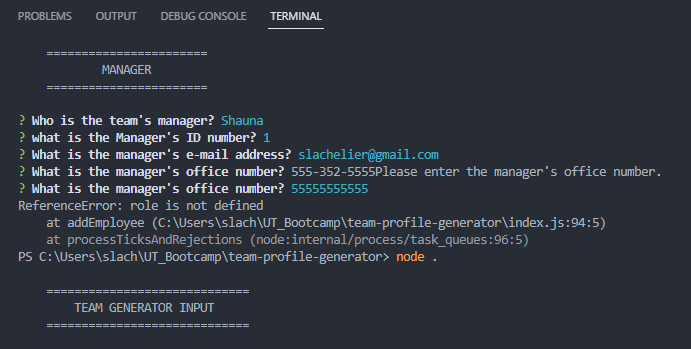

# Team Profile Generator
[](https://opensource.org/licenses/MIT)

## Project Description
This is a command line application that uses inquirer to receive user input for entering employee information for a software engineering team. An HTML webpage is generated from this data that displays summaries for each employee. Jest was utilized in this project for test-driven development.

## User Story
```
{
AS A manager
I WANT to generate a webpage that displays my team's basic info
SO THAT I have quick access to their emails and GitHub profiles
}
```

## Acceptance Criteria
```
{
GIVEN a command-line application that accepts user input
WHEN I am prompted for my team members and their information
THEN an HTML file is generated that displays a nicely formatted team roster based on user input
WHEN I click on an email address in the HTML
THEN my default email program opens and populates the TO field of the email with the address
WHEN I click on the GitHub username
THEN that GitHub profile opens in a new tab
WHEN I start the application
THEN I am prompted to enter the team manager’s name, employee ID, email address, and office number
WHEN I enter the team manager’s name, employee ID, email address, and office number
THEN I am presented with a menu with the option to add an engineer or an intern or to finish building my team
WHEN I select the engineer option
THEN I am prompted to enter the engineer’s name, ID, email, and GitHub username, and I am taken back to the menu
WHEN I select the intern option
THEN I am prompted to enter the intern’s name, ID, email, and school, and I am taken back to the menu
WHEN I decide to finish building my team
THEN I exit the application, and the HTML is generated
}
```

## Examples
	
    
    [Example HTML page](./assets/example.html)

## Installation
Once the repository is downloaded, you will want to ensure that these folders are already present:
```
{
.
├── __tests__/             //jest tests
│   ├── Employee.test.js
│   ├── Engineer.test.js
│   ├── Intern.test.js
│   └── Manager.test.js
├── dist/                  // rendered output (HTML) and CSS style sheet      
├── lib/                   // classes
├── src/                   // template helper code 
├── .gitignore             // indicates which folders and files Git should ignore
├── index.js               // runs the application
└── package.json   
}
```
You will need node.js on your computer to run this application, as well as all of the dependencies in the package.json. Run `npm i` in the terminal to install the packages.

## Usage

You can run the application by typing `node .` into the terminal.

Once the program begins, enter the employee information according to the prompts.


[Video Preview](https://drive.google.com/file/d/171gJ3kSOBaPc1aPCLV4kW13Lm2QLxrU0/view)

After your responses have been input and recorded, an index.HTML file will be generated in the dist folder.

# License

This project is licensed under the terms of the MIT license.
[MIT License](https://opensource.org/licenses/MIT)
